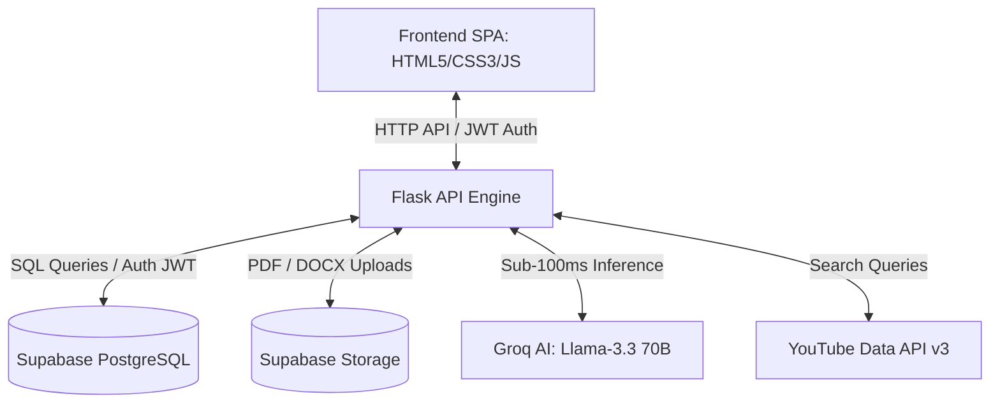
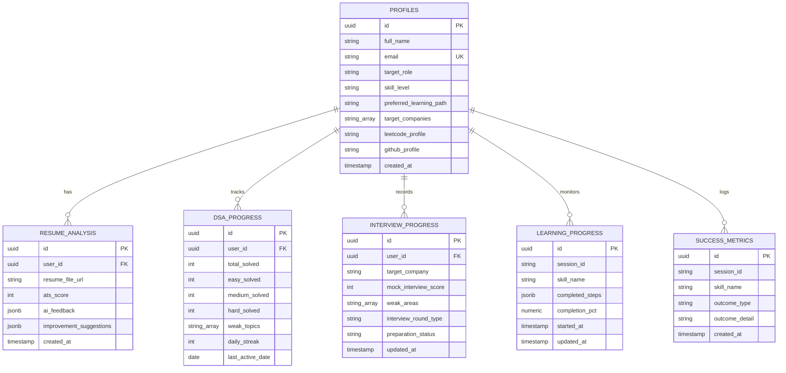

# 🛰️ SkillPath — Enterprise AI Career Accelerator

SkillPath is a high-performance, SaaS-style career readiness platform designed to accelerate candidate readiness for FAANG and top-tier technology companies. By orchestrating multi-agent LLM systems, local curated learning pathways, and cloud-scale database operations, SkillPath offers hyper-personalized roadmap extraction, resume assessment, algorithmic practice metrics, and mock interview targeting.

---

<p align="center">
  <a href="https://www.python.org/">
    
  </a>
  <a href="https://flask.palletsprojects.com/">
    
  </a>
  <a href="https://supabase.com/">
    
  </a>
  <a href="https://groq.com/">
    
  </a>
  <a href="https://opensource.org/licenses/MIT">
    
  </a>
  <a href="https://github.com/P-adithyagoud/AI-CATALYST/pulls">
    
  </a>
</p>

---

## 🏗️ System Architecture

SkillPath is designed around a decoupled client-server architecture backed by a scalable SQL persistence layer and a high-throughput AI inference engine.



1. **SPA Client**: Serves the user interface with a glassmorphic dashboard (Nebula Design System), using Chart.js for data visualization.
2. **Flask Backend**: Processes incoming REST requests, manages authentication middleware via JWT checks, and coordinates search logic and AI execution.
3. **Supabase Cloud**: Persists profile history, DSA completion states, resume scores, and custom checklists. Incorporates Postgres Row-Level Security (RLS) policies for user data isolation.
4. **Groq AI Engine**: Evaluates resume transcripts, grades ATS matches, and constructs personalized roadmap workflows.

---

## 🌟 Core Pillars

### 1. Hybrid Skill & Certification Router
- **Tier-1 Local Cache**: Instantly maps core topics (e.g. Python, Java, DSA) using pre-packaged, validated local datasets.
- **Tier-2 YouTube Playlists fallback**: Fetches real-time learning playlists from YouTube Data API v3 with a local trust scoring system.
- **Tier-3 AI Recommendation engine**: Triggers Llama-3.3 70B via Groq for niche subjects, structuring recommendations into 5 levels: *Primary, Fast Track, Interview, Project, and Advanced*.

### 2. Multi-Stage Resume Evaluator
- **Parsing Suite**: Integrates `pypdf` and `docx2txt` libraries to unpack resume uploads.
- **Recruiter Sandbox Simulation**: Evaluates resumes through three distinct lenses:
  - **ATS Scanner**: Keyword matching and structural parsing compliance.
  - **Recruiter snap judgment**: Simulated 6-second review of critical highlights.
  - **Hiring Manager audit**: Technical depth assessment.
- **Actionable Output**: Delivers an overall rating out of 10, project ideas, suggested tools, and line-by-line bullet rewrites.

### 3. DSA Command Center & Performance Analytics
- **Corporate Question Mappings**: Frequency-ranked problem sets for over 100+ global tech organizations.
- **GitHub-Style Learning Heatmap**: Visualizes daily commits, playlist progress, and practice streaks using SVG.
- **Personal Readiness Index (PRI)**: Evaluates overall preparedness based on a weighted multi-variable index:
  $$\text{PRI} = (\text{DSA\_Score} \times 0.40) + (\text{Resume\_Score} \times 0.30) + (\text{Playlist\_Progress} \times 0.15) + (\text{Projects\_Score} \times 0.15)$$
- **Competency Radar**: Automatically benchmarks candidate profiles against baseline FAANG role performance indexes (e.g. Intern, L3, L4, L5).

---

## 🛠️ Technology Stack

| Layer | Technology | Purpose |
| :--- | :--- | :--- |
| **Backend Framework** | [Python 3.9+](https://www.python.org/) · [Flask](https://flask.palletsprojects.com/) | REST API development, routing, and backend integrations. |
| **AI Inference** | [Groq SDK](https://groq.com/) (`llama-3.3-70b-versatile`) | Ultra-fast token generation for resumes and roadmaps. |
| **Database & Storage** | [Supabase](https://supabase.com/) (PostgreSQL 15) | Relational database, Object storage, and RLS policies. |
| **Authentication** | Supabase Auth + JWT Bearer Tokens | Stateless JWT-based authentication for backend endpoints. |
| **Frontend UI** | HTML5 · CSS3 · Vanilla JS | Glassmorphic, dark-themed responsive UI dashboard. |
| **Charting Engine** | [Chart.js](https://www.chartjs.org/) | Renders the radar graphs and chronological progress history. |

---

## 📁 Repository Directory Structure

```text
AI-CATALYST/
├── app.py                      # Core Flask API Gateway & AI Orchestrator
├── requirements.txt            # Python dependencies configuration
├── .env                        # Configuration & Secret Variables (git-ignored)
├── README.md                   # System Documentation
│
├── static/                     # Single Page Application Frontend
│   ├── login.html              # Glassmorphic Login & User Signup Page
│   ├── index.html              # Main Control Dashboard SPA
│   ├── css/
│   │   └── style.css           # Nebula Design Tokens & Interface Layouts
│   └── js/
│       ├── app.js              # Frontend Controller & Orchestration logic
│       └── supabaseClient.js   # Supabase Client Wrapper
│
├── supabase/                   # Database Infrastructure
│   ├── consolidated_schema.sql # Unified SQL Script to bootstrap schema
│   ├── config.toml             # Supabase Infrastructure Configuration
│   └── migrations/             # Local database migration scripts
│
└── data/                       # Data Pipeline Asset Storage
    ├── leetcode-companywise/   # CSV databases of company questions
    ├── certifications/         # Static datasets of professional credentials
    └── *.csv                   # Static YouTube playlist configurations
```

---

## 🚀 Getting Started

### 1. Prerequisites
- **Python 3.9** or higher installed.
- A **Supabase** account with a configured database project.
- A **Groq** API Key for AI-driven modules.

### 2. Clone and Setup Environment
```bash
git clone https://github.com/P-adithyagoud/AI-CATALYST.git
cd AI-CATALYST

# Initialize virtual environment
python -m venv venv
source venv/Scripts/activate  # On macOS/Linux: source venv/bin/activate

# Install required dependencies
pip install -r requirements.txt
```

### 3. Define Environment Configuration
Create a `.env` file in the project root:
```env
# Flask configuration
SECRET_KEY=your_secure_flask_secret_key

# Supabase API Credentials
SUPABASE_URL=https://your-project.supabase.co
SUPABASE_ANON_KEY=your_anon_key_here
SUPABASE_SERVICE_KEY=your_service_role_key_here

# AI Model Inference Key
GROQ_API_KEY=gsk_your_groq_api_key_here

# Third-party Integrations (Optional)
YOUTUBE_API_KEY=your_youtube_api_key_here
```

### 4. Setup Database Schema
1. Log in to your [Supabase Dashboard](https://supabase.com).
2. Navigate to your project's **SQL Editor** -> **New Query**.
3. Copy the entire contents of [consolidated_schema.sql](file:///c:/PROJECTS/SKILL%20PATH/AI-CATALYST-main/AI-CATALYST-main/supabase/consolidated_schema.sql) and paste them into the editor.
4. Click **Run** to provision the tables, indexes, triggers, and storage buckets.

### 5. Launch the Server
```bash
python app.py
```
Open **`http://localhost:5000`** in your browser. The application will serve the login interface; register a user profile to access the SPA dashboard.

---

## 🔌 API Reference

All requests to endpoints (excluding `/login`, `/signup`, and `/login-page`) require a valid JWT passed in the request headers:
`Authorization: Bearer <your_supabase_jwt_token>`

### Endpoints Overview

| Method | Endpoint | Description | Headers |
| :--- | :--- | :--- | :--- |
| `POST` | `/signup` | Create a new user profile in Supabase Auth | None |
| `POST` | `/login` | Authenticate user credentials and return JWT | None |
| `POST` | `/get-resource` | Query skill path roadmap and recommendations | `Authorization` |
| `POST` | `/analyze-resume` | Parse and evaluate resume transcript | `Authorization` |
| `GET` | `/get-companies` | Fetch supported target companies for DSA | `Authorization` |
| `GET` | `/get-questions` | Fetch frequency-sorted LeetCode questions | `Authorization` |
| `POST` | `/generate-competency-audit` | Generate a career readiness report via AI | `Authorization` |
| `POST` | `/sync-user-projects` | Save portfolio list to Supabase | `Authorization` |
| `POST` | `/sync-active-roadmap` | Save active checklist roadmap checklist | `Authorization` |

---

## 🗄️ Database Architecture

Below is the entity-relationship model defining user mapping, analytics progress tracking, and caching layers.



---

## 🤝 Contribution Guidelines

We welcome contributions from the developer community. To maintain high code quality standards, please adhere to the following workflow:

1. **Fork** the repository and create your feature branch: `git checkout -b feature/AmazingFeature`.
2. Ensure your code follows [PEP 8](https://peps.python.org/pep-0008/) naming conventions.
3. Write comprehensive unit tests for any new API functionality.
4. Run locally to verify performance impact before opening a Pull Request.
5. Open a Pull Request referencing the issue or feature description.

---

## 📄 License

Distributed under the MIT License. See [LICENSE](LICENSE) for details.

---

*Built with ❤️ for the next generation of software engineers.*
 